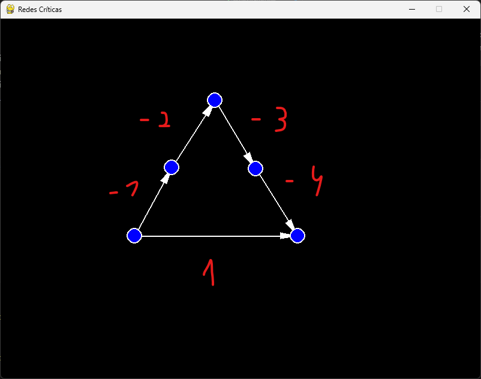
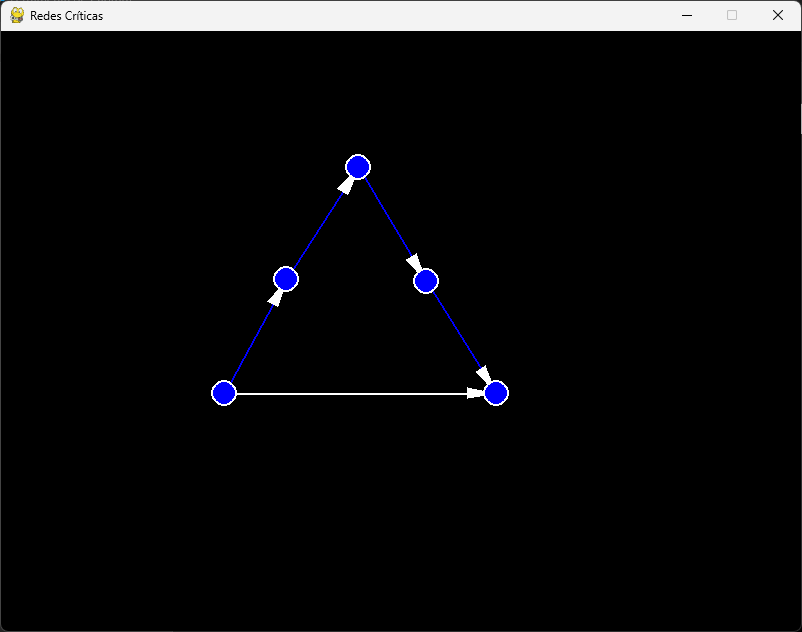

# Programação Dinâmica - Algoritmo de Bellman-Ford

**Número da Lista**: 23  
**Conteúdo da Disciplina**: Grafos 2  

## Alunos
| Matrícula  | Aluno                                           |
|------------|-------------------------------------------------|
| 20/0073249 | Pedro Vitor Augusto de Jesus                   |

## Sobre

Este projeto é uma aplicação gráfica que permite a criação e visualização de grafos e a execução do algoritmo de Bellman-Ford para encontrar o menor caminho entre dois nós. A interface é construída utilizando a biblioteca `pygame`, proporcionando uma ferramenta interativa para adicionar nós e arestas, calcular o menor caminho entre nós e detectar ciclos negativos. Além disso, a aplicação oferece a capacidade de resetar o grafo e colorir as arestas que fazem parte do menor caminho.

O principal objetivo é fornecer uma ferramenta de aprendizado para visualizar o funcionamento do algoritmo de Bellman-Ford e o comportamento dos grafos.

## Funcionalidades

- Adição de nós e arestas ao grafo.
- Cálculo do menor caminho entre dois nós utilizando o algoritmo de Bellman-Ford.
- Detecção de ciclos negativos e exibição de um pop-up informativo.
- Reset do grafo em caso de ciclo negativo ou quando o usuário desejar reiniciar.
- Visualização das arestas que compõem o menor caminho em azul.

## Screenshots




## Apresentação

[Link para a apresentação](https://www.youtube.com/watch?v=ExcqEanExIM)

## Instalação

### Pré-requisitos

- Python 3.x
- Pygame

### Instalação do Pygame

1. Instale o pygame:
   ```sh
   pip install pygame
   ```

### Estrutura do Projeto

- `src/front/colors.py`: Define as cores usadas na interface.
- `src/front/node.py`: Implementa a classe `Node` para representar os nós do grafo.
- `src/front/edge.py`: Implementa a classe `Edge` para representar as arestas do grafo.
- `src/back/main.py`: Implementa a classe `Graph` com os métodos para construir o grafo, executar o algoritmo de Bellman-Ford e detectar ciclos negativos.

## Uso

1. Execute o arquivo principal do projeto:
   ```sh
   python main.py
   ```

2. Adicione nós clicando com o botão esquerdo do mouse na área de desenho.

3. Conecte os nós clicando com o botão direito do mouse em dois nós diferentes e inserindo o custo da aresta.

4. Pressione a tecla `ESPACO` para calcular o menor caminho entre o primeiro e o último nó criado.

5. Caso um ciclo negativo seja detectado, um pop-up será exibido. Pressione `ENTER` ou `ESC` para reiniciar o grafo.
